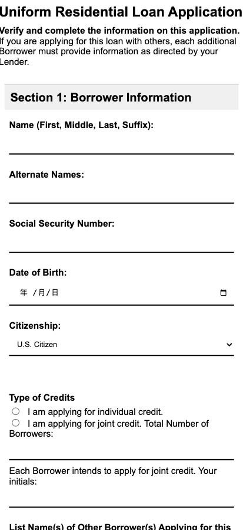

# Loan Application Form

This repository provides a simple, responsive HTML form template for a **Uniform Residential Loan Application**. It gathers essential information for a loan application, including borrower details, contact information, address history, and employment/income information.

## Features

- **Borrower Information**: Collects basic details about the applicant, such as name, social security number, date of birth, and citizenship status.
- **Contact Information**: Fields for phone numbers (home, cell, work) and email address.
- **Address History**: Captures current, former, and mailing address information.
- **Employment & Income Information**: Includes fields for employer details, job title, start date, and monthly income types.

## Project Structure

- **HTML Structure**: Organized with semantic elements and sections for ease of navigation and readability.
- **CSS Styling**: Custom CSS for responsive and clean layout with form elements, including tables and input fields for structured data entry.
- **Form Sections**:
  - Borrower Information
  - Employment & Income Details
  - Contact and Address Information

## Form Sections Overview

### Section 1: Borrower Information
Collects the following:
- Full Name, Alternate Names
- Social Security Number (SSN)
- Date of Birth, Citizenship
- Marital Status and Dependents

### Section 2: Employment/Income Information
Gathers employment details, including:
- Employer name, address, and contact
- Monthly income breakdown (base, overtime, bonus, etc.)

## Usage

1. Clone or download this repository.
2. Open the `index.html` file in a web browser to view and interact with the form.

### Customization
To adjust styles or layout, edit the `<style>` section in the `<head>` of `index.html`:
- Change fonts, colors, or layout using CSS.
- Modify placeholder text for specific input fields if needed.

## Preview

## License

This project is licensed under the MIT License. Feel free to use, modify, and distribute.

---

This project provides a foundational form structure and design for a loan application that can be extended to fit specific requirements.